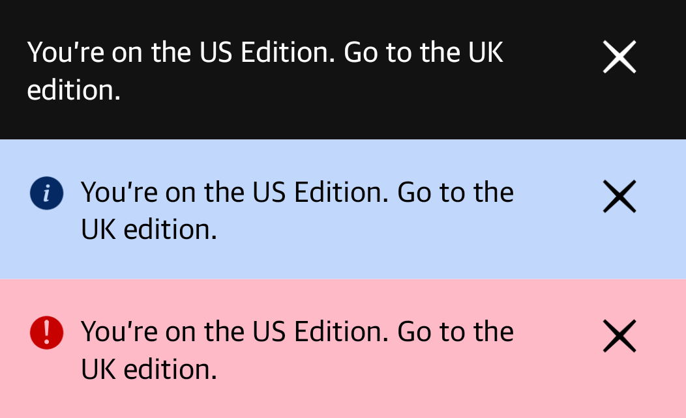

# The Source library for Android

[](https://central.sonatype.com/artifact/com.gu.source/source-android)


## Add the library dependency

Add the dependency to `build.gradle.kts` for the consuming module.

In `build.gradle.kts`:

```kotlin
implementation("com.gu.source:source-android:<version>")
```

In version catalog:
```toml
[versions]
source = "<version>"

[libraries]
source = { module = "com.gu.source:source-android", version.ref = "source" }
```

<!-- Alternatively, add it to your app's core design module as an `api` dependency. It will be transitively available to all other modules:

```kotlin
api("com.gu.source:source-android:<version>")
```-->

> [!note]
> See [here](#building-and-using-directly) if you need to build and bundle the library as a local repository.

## Using the library

The library provides design presets and components.

The design presets are available name spaced under the `com.gu.Source` object, e.g. `Source.Typography.HeadlineBold15`.

**[Full API documentation is available here.](https://guardian.github.io/source-apps/android/docs/index.html)**

---

## Presets

### Typography

Typography presets include `fontFamily`, `fontSize`, `lineHeight`, `fontWeight`, `fontStyle` in a single token. [All typography tokens with their previews are listed here](source/src/main/kotlin/com/gu/source/presets/typography/README.md)

The library bundles app font files, so they are not separately required in consumer apps.

Use typography presets directly in a `Text` component.

```kotlin
Text(
    text = "The world's leading liberal voice",
    // Using Source typography preset
    style = Source.Typography.TextEgyptianItalic14,
)
```

---

### Palette colours

Core palette colours are available for direct use in components through `Source.Palette`. [Preview all available colours here](source/src/main/kotlin/com/gu/source/presets/palette/palette.png).

```kotlin
Text(
    text = "The world's leading liberal voice",
    // Using Source palette colours
    color = Source.Palette.Brand400,
)
```

---

### Icons

Icons are available as `ImageVector` objects under the `Source.Icons.Base` namespace. The library provides a set of icons that can be used directly in components.

[See here for all available icons.][icons]

```kotlin
Icon(
    imageVector = Source.Icons.Base.Checkmark,
    contentDescription = null,
)
```

---

## Components

### Buttons

Four core button components are available - `SourceButton`, `SourceIconButton`, `PlainSourceButton` and `SourceBaseIconButton`.

[See here for full details of the button components.][buttons]

---

### Chips

Chip components are typically used for filter, tags, or actions in a concise 
format.

[See here for full details of the chip components.][chips]

---

### Promo stickers

The Promo Sticker is a visual indicator used to draw user attention to new or recommended products 
without disrupting the interface. They are available in two sizes and four styles.

[See here for full details of the chip components.][promosticker]

---

### Pager progress components

Three pager progress components are available:

1. `PagerProgressBar` - a higher level component that combines the above two
   and has different phone and tablet behaviour.
2. `PagerProgressIndicator` - a set of highly customisable indicators to signify progress as a user
   progresses through the items in the pager.
3. `PagerProgressButtons` - buttons to allow user to go to next/previous page in a pager.

[See here for more details on pager progress components.][pager]

---

### Alert banners

The `AlertBanner` component is used to display alerts at the top of the screen. It supports three
alert priorites - `Neutral`, `Info` and `Error`. The three alert priorities have different display
styles corresponding to Source specifications.

##### Usage example

```kotlin
AlertBanner(
    text = "This is an alert banner",
    priority = AlertBanner.Priority.Info,
    onMessageClick = { /* Handle action */ },
    onDismiss = { /* Handle dismiss */ },
    modifier = Modifier.fillMaxWidth(),
)
```



----

## Building and using directly

### As a bundled repo

1. Build the library
   Run
   ```shell
   ./gradlew :source:publishReleasePublicationToGusourceRepository
   ```
   This will produce the library output at `/source/build/gusource/`.

2. Copy the built library to the news app
   Copy the library the built folder from `/source/build/gusource/` to the `android-news-app/src/main/libs/maven` folder in the `android-news-app` repo.

3. Update the version number in the news app
   If the library version has changed, update it in the version catalog for the news app.

### From maven local

1. Build the library
   Run
   ```shell
   ./gradlew :source:publishToMavenLocal
   ```
   This will publish the library to your local maven repository.

2. Update the version number in the news app
   If the library version has changed, update it in the version catalog for the news app.
   
3. Ensure you have `mavenLocal` declared first in your repositories
   ```groovy
   repositories {
       mavenLocal()
       mavenCentral()
       google()
   }
   ```

### Other notes

1. We use the `com.gu` package name and group id so we can use the Guardian's Sonatype infra for signing and publishing the library. See [this comment](https://github.com/guardian/source-android/pull/10/files?w=1#r1567071142) for reference. 


[buttons]: ./source/src/main/kotlin/com/gu/source/components/buttons/README.md
[pager]: ./source/src/main/kotlin/com/gu/source/components/pager/README.md
[chips]: ./source/src/main/kotlin/com/gu/source/components/chips/README.md
[promosticker]: ./source/src/main/kotlin/com/gu/source/components/promosticker/README.md
[icons]: ./source/src/main/kotlin/com/gu/source/icons/README.md